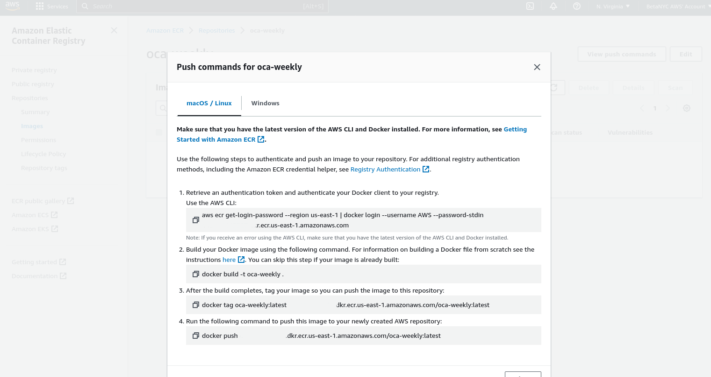
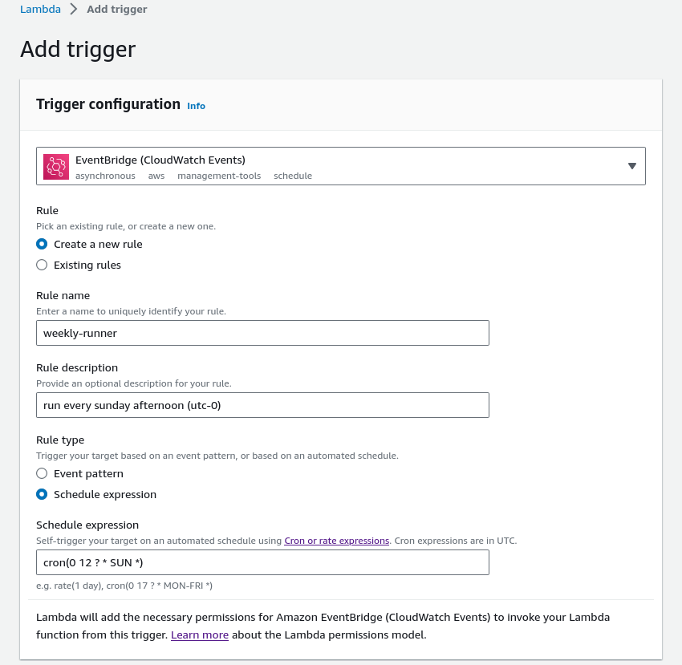
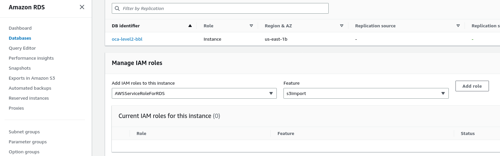

# NYC Housing Court Filings

The OCA Data Collective regularly receives housing court filings data from the New York State Office of Court Administration (OCA). In this repository we manage the Extract-Transform-Load process for getting raw XML filings data from OCA via SFTP, parsing the nested XML data into a set of tables, and making those CSV files publicly available for download. These data are also now publicly available in XML format on the court system's [website](https://ww2.nycourts.gov/landlord-tenant-data-34621).

To work with these data you can use the [NYCDB](https://github.com/nycdb/nycdb) to automatically load all of the tables into a PostgreSQL database for analysis. You can also find documentation about the data, including a [data dictionary](https://docs.google.com/spreadsheets/d/1GMDomQr8gEave6uLpLby9gQU0oMoGRL39kQdNbBJEqE) on the [NYCDB wiki](https://github.com/nycdb/nycdb/wiki/Dataset:-OCA-Housing-Court-Records).

The OCA Data Collective includes the [Right to Counsel Coalition](https://www.righttocounselnyc.org/), [BetaNYC](https://beta.nyc/), the [Association for Neighborhood and Housing Development](https://anhd.org/), the [University Neighborhood Housing Program](https://unhp.org), and [JustFix](https://www.justfix.org/). It is also affiliated with the [Housing Data Coalition](https://www.housingdatanyc.org/) (HDC). 

## Attribution

When utilizing this work, please use one of the following attributions and links:

> Data from the New York State Office of Court Administration via the OCA Data Collective in collaboration with the [Right to Counsel Coalition](https://www.righttocounselnyc.org/).

> Data from the New York State Office of Court Administration via the OCA Data Collective. This data has been obtained and made available through the collaborative efforts of the [Right to Counsel Coalition](https://www.righttocounselnyc.org/), [BetaNYC](https://beta.nyc/), the [Association for Neighborhood and Housing Development](https://anhd.org/), the [University Neighborhood Housing Program](https://unhp.org), and [JustFix](https://www.justfix.org/).

## License 

This work is licensed under a [Creative Commons Attribution-NonCommercial-ShareAlike 4.0 International License](http://creativecommons.org/licenses/by-nc-sa/4.0/). 

<a rel="license" href="http://creativecommons.org/licenses/by-nc-sa/4.0/"></a>

## CSV Files

[](https://oca-2-dev.s3.amazonaws.com/public/last-updated-date.txt)

* [`oca_index`](https://oca-2-dev.s3.amazonaws.com/public/oca_index.csv)
* [`oca_causes`](https://oca-2-dev.s3.amazonaws.com/public/oca_causes.csv)
* [`oca_addresses`](https://oca-2-dev.s3.amazonaws.com/public/oca_addresses.csv)
* [`oca_parties`](https://oca-2-dev.s3.amazonaws.com/public/oca_parties.csv)
* [`oca_events`](https://oca-2-dev.s3.amazonaws.com/public/oca_events.csv)
* [`oca_appearances`](https://oca-2-dev.s3.amazonaws.com/public/oca_appearances.csv)
* [`oca_appearance_outcomes`](https://oca-2-dev.s3.amazonaws.com/public/oca_appearance_outcomes.csv)
* [`oca_motions`](https://oca-2-dev.s3.amazonaws.com/public/oca_motions.csv)
* [`oca_decisions`](https://oca-2-dev.s3.amazonaws.com/public/oca_decisions.csv)
* [`oca_judgments`](https://oca-2-dev.s3.amazonaws.com/public/oca_judgments.csv)
* [`oca_warrants`](https://oca-2-dev.s3.amazonaws.com/public/oca_warrants.csv)


## About the data

The data we receive from OCA is an extract of all landlord and tenant cases in NYC housing court, without personally identifying information. For more details about the raw data and the final parsed tables, see [`/docs`](/docs).

## About the code

For information about the details of various components, see [`/lib`](/lib)

### Local Setup

First, you will only be able to run this yourself if you have HDC's credentials to access to the SFTP to get the raw data transfered from OCA and access to the private AWS S3 where those files are stored. 

You will need Docker and Docker Compose.

First, you'll want to create an `.env` file by copying the example one:

```
cp .env.example .env     # Or 'copy .env.example .env' on Windows
```

Take a look at the `.env` file and fill in the AWS S3 credentials.


To run the whole process in the docker container run:

```
docker-compose up 
```

### Jupyter notebook for maintenance

Comment out `CMD ["python", "oca_update.py"]` in the Dockerfile

```
docker-compose up -d
docker-compose exec app /bin/bash
jupyter notebook --allow-root --ip 0.0.0.0 --no-browser
```

### Setting up a S3 Bucket

```json
{
    "Version": "2012-10-17",
    "Id": "Policy1234",
    "Statement": [
        {
            "Sid": "Stmt1623892536589",
            "Effect": "Allow",
            "Principal": {
                "AWS": "arn:aws:iam::...user or api account"
            },
            "Action": "s3:*",
            "Resource": "arn:aws:s3:::...bucket or specific folder..."
        },
         {
            "Sid": "IPAllow",
            "Effect": "Allow",
            "Principal": "*",
            "Action": "s3:GetObject",
            "Resource": "arn:aws:s3:::oca-2-dev/public/*",
            "Condition": {
                "IpAddress": {
                    "aws:SourceIp": [
                        "192.168.1.1"
                    ]
                }
            }
        }
    ]
}
```

### Setting up an RDS instance

Since we use both `SELECT aws_s3.table_import_from_s3` and `SELECT * from aws_s3.query_export_to_s3` in the RDS, you need to install the aws_s3 extension. `CREATE EXTENSION IF NOT EXISTS aws_s3 CASCADE;`

Make sure that RDS has IAM roles of AWSServiceRoleForRDS for s3Import, and custom role for s3Export so that you can write to the bucket as well as use Server Side Encryption with AWS KMS managed keys.

```json
{
	"Version": "2012-10-17",
	"Statement": [
		{
			"Sid": "VisualEditor1",
			"Effect": "Allow",
			"Action": [
				"s3:PutObject",
				"s3:GetObject",
				"s3:AbortMultipartUpload",
				"s3:ListBucket",
				"s3:DeleteObject",
				"s3:ListMultipartUploadParts"
			],
			"Resource": [
				"arn:aws:s3:::oca-2-dev",
				"arn:aws:s3:::oca-2-dev/*"
			]
		},
		{
			"Sid": "KMSPermissions",
			"Effect": "Allow",
			"Action": [
				"kms:GenerateDataKey",
				"kms:Decrypt",
				"kms:DescribeKey",
				"kms:CreateGrant"
			],
			"Resource": [
				"arn:aws:kms:*:*:key/*"
			]
		}
	]
}
```

## Cron job for Synology

### Export an image using docker

docker save -o oca.tar oca-app

### Create two tasks

docker run -d --name oca-app --user root -v /volume1/docker/oca:/app --restart unless-stopped oca-app tail -f /dev/null >> /volume1/docker/cron.log 2>&1

echo "$(date): Running script" >> /volume1/docker/cron.log
docker exec oca-app python /app/oca_update.py >> /volume1/docker/cron.log 2>&1
echo "$(date): Completed" >> /volume1/docker/cron.log

<!-- 
the max timeout of 15 minutes. this does not provide much flexibility for longer runtimes. 

### (Optional) Running on AWS ECR and Lambda

Setup [AWS CLI](https://aws.amazon.com/cli/) and create an ECR repository.

```
cp .env.example .env   # fill all the credentials. Change the db to a remote dbi instead of the local docker.

aws configure

docker build . -t oca-weekly --build-arg MODE=2 --build-arg SFTP_HOST=sftp.[rest of the url] .
```

Follow the push commands. You can to the screen by clicking into the repository you create and on the "View push commands" on the right below the breadcrumbs. Skip the second command `docker build -t ...`



Now in Lambda, create a new function from a Container Image and then 'Browse Images'. *You need to replace / deploy a new image any time you update the ECR image.*  

Increase Memory to `10240` MB and Ephemeral storage to `8000` MB. AND Timeout to `15` minutes.


#### Tiggers

 


### (Optional) RDS Clone

If you have an existing database on Amazon, you can use S3 to "clone" the CSV files to the RDS service (or you can do a sql.dump). To enable add  the RDS database uri to the `CLONED_DATABASE_URL` variable in the .env file. 

Make sure to run `CREATE EXTENSION aws_s3 CASCADE;` as you may encounter the error message `schema "aws_commons" does not exist"` if you do not. Read [this](https://docs.aws.amazon.com/AmazonRDS/latest/UserGuide/USER_PostgreSQL.S3Import.html) for more details on setting up Postgresql for s3 imports.

After the main process is done, additional scripts will overwrite the contents on the RDS. Make sure there are proper permissions for the RDS to connect to S3 (if there is a bucket policy).



-->