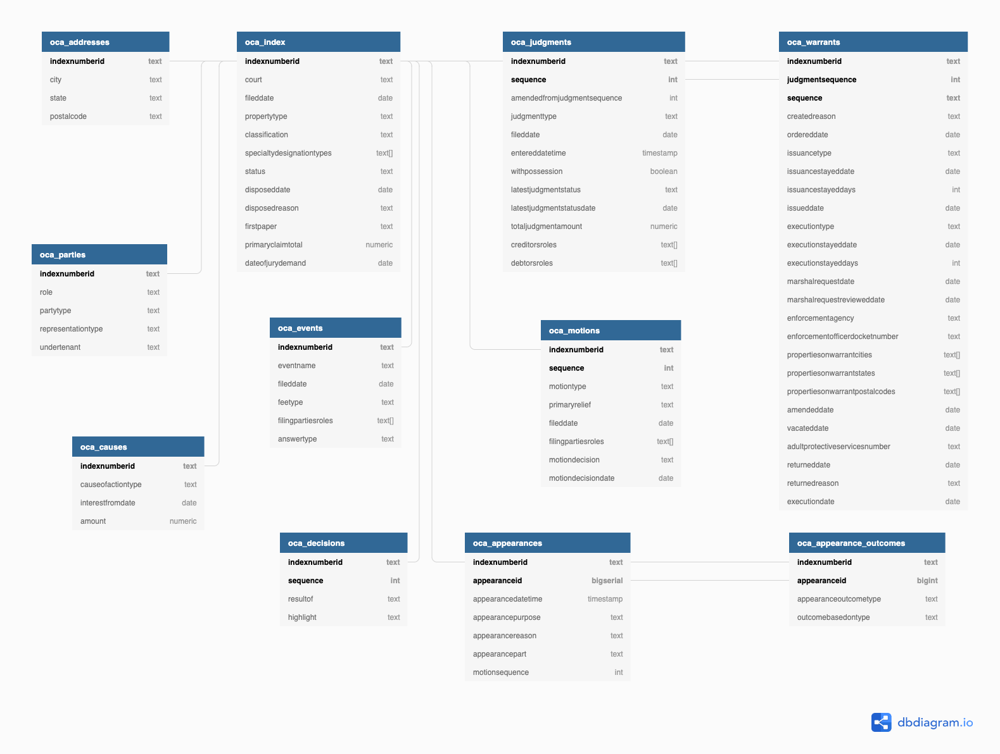

# Documentation

The New York State Office of Court Administration (OCA) provided us some official documentation of the data request extract file and supporting documentation of the courts that are and are not included in the Uniform Court System (UCS) and the extract. 

## Courts included/excluded from data

The Excel file [`UCS_Town-and-Village-and-City-Court-Listings_2020-01.xlsx`](UCS_Town-and-Village-and-City-Court-Listings_2020-01.xlsx) was provided by OCA and contains a list of all the City Civil Courts that _are_ included in the UCS data extract. These cover all _cities_ in New York, including New York City. It also has a sheet of all the Town and Village Courts that operate under a different system and therefore not included in our UCS data extract.

For ease of use, the two sheets of courts that are included or excluded from the data have been extracted to the following CSV files:  
* [`city-courts_included.csv`](city-courts_included.csv)  
* [`town-village-courts_excluded.csv`](town-village-courts_excluded.csv)  

## Data extract layout

The PDF file [`oca-extract-info.pdf`](oca-extract-info.pdf) was provided by OCA and contains the details of the XML formatted data extract that OCA provides us and is processed by the code in this project. The file includes the structure of the XML data and how elements about each case are nested in different sections, as well as information about the individual data elements and their meaning. This information was used to creating the code used in this project to parse the nested XML data into a series of flat CSV files. 

## Processed data layout

In the original XML data, each case has many nested sections with information about different elements of the case, such as addresses, warrants, judgments, etc. For the final data to work in a relational database, in parsing the XML we need to flatten out the nested structure into a series of tables. This is a fairly straightforward process for most parts, and only one additional column needed to be created to establish a link between two tables. 

This is the final structure of the tables, created by the free tool [dbdiagram.io](https://dbdiagram.io/) using the information in [`dbdiagram.txt`](dbdiagram.txt).

 

## Data dictionary

The folder [`/csv-data-dictionary`](/csv-data-dictionary) contains a CSV file for each of the final tables and records the column name, data type, official definition from the documentation file, and an extra column for notes where we can add helpful information about the columns as we continue learning about the data.
