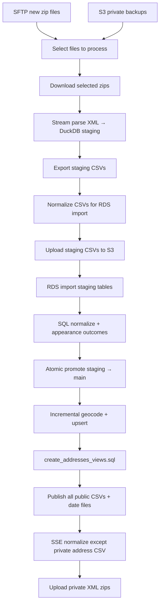

# OCA ETL pipeline

This directory contains the Extract–Transform–Load pipeline that ingests NY State housing court XML from OCA, parses it into relational tables, loads PostgreSQL on RDS, geocodes addresses, and publishes CSVs to S3. This process works with the protected address-level data ("level 2") but maintains public exports of the deidentified (zip code only, "level 1") version with the full address data kept only in secure S3 and RDS for organization under the legal agreement with OCA.

Entry point: [`oca_update.py`](../oca_update.py) loads `.env` and calls `oca_etl()` in [`etl.py`](etl.py).

## Pipeline flow

Each run is orchestrated sequentially in `oca_etl()`. See [`etl_stages.py`](etl_stages.py) for stage implementations.

## Stages

| Stage | Module | What it does |
|-------|--------|--------------|
| Select files | `etl_file_selection.py`, `etl_stages.select_input_files` | Picks new SFTP zips and/or S3 private replays (`REPROCESS_GLOB`); skips manifest-completed files unless `FORCE_REPROCESS=true`. |
| Download | `etl_stages.download_selected_files` | New files from SFTP; replay files from S3 private backup. |
| Parse | `parsers.py`, `duckdb_database.py` | Streaming XML parse into local DuckDB (`staging.duckdb`); batched writes via `parse_write_buffer.py`. |
| Export + preprocess | `duckdb_database.py`, `staging_csv_export.py`, `etl_csv.py` | DuckDB `COPY` with Postgres-compatible transforms; minimal second-pass CSV rewrite. |
| Import + promote | `etl_stages.import_and_promote_staging`, `etl_promotion.py` | Bootstrap core tables, import staging CSVs via `aws_s3`, normalize, then single-transaction promotion. |
| Geocode | `etl_geocode.py`, `etl_stages.geocode_addresses` | Delta-select rows missing lat/lon; Geosupport + Census batch; upsert by natural address key. |
| Publish public | `etl_stages.publish_public_artifacts` | Rebuild address views; export all `OCA_TABLES` and address views; upload date badge files. |
| Normalize encryption | `etl_stages.normalize_public_s3_encryption` | SSE-S3 on published keys except `oca_addresses_private.csv`. |
| Upload private | `etl_stages.upload_private_source_files` | Back up raw XML zips to S3 `private/`. |

## Key modules

### Connectivity

- [`sftp.py`](sftp.py) — list and download raw XML zip files from OCA SFTP.
- [`s3.py`](s3.py) — S3 upload/download, encryption normalization (`update_encryption`).
- [`database.py`](database.py) — PostgreSQL connection (NYCDB-derived), schema `search_path`, TCP keepalives, automatic reconnect after idle drops, transactions, `aws_s3` import/export helpers.

### Parse and local staging

- [`parsers.py`](parsers.py) — stream `<Index>` nodes from XML; per-case child table replace semantics; delete-event handling.
- [`duckdb_database.py`](duckdb_database.py) — local DuckDB staging DB; export to CSV with contract transforms.
- [`parse_write_buffer.py`](parse_write_buffer.py) — buffer INSERTs and flush in transaction windows (`PARSE_WRITE_*` env knobs).
- [`staging_csv_export.py`](staging_csv_export.py) — per-table export specs (Postgres array literals, nullable ints, appearances column rules).

### ETL orchestration

- [`etl.py`](etl.py) — run orchestrator, manifest lifecycle, stage sequencing.
- [`etl_constants.py`](etl_constants.py) — table list, zip patterns, S3 folder constants.
- [`etl_run_manifest.py`](etl_run_manifest.py) — `etl_runs` / `etl_files` / `etl_steps` bookkeeping.
- [`etl_helpers.py`](etl_helpers.py) — paths, CSV row checks, PLUTO download, local SVG date badge files.
- [`etl_csv.py`](etl_csv.py) — streaming CSV normalization for tables not handled at export time.
- [`etl_promotion.py`](etl_promotion.py) — atomic `promote_staging_to_main()`; count/checksum hooks for validation.
- [`etl_publish.py`](etl_publish.py) — S3 export helpers and encryption key filtering.
- [`etl_geocode.py`](etl_geocode.py) — incremental geocode candidate fetch, chunked geocoding, natural-key upsert.

### Geocoding

- [`geocode_record.py`](geocode_record.py) — address normalization (usaddress), NYC Geosupport, Census batch geocoder.

## SQL scripts (`lib/sql/`)

Scripts run against the active session schema (`DB_SCHEMA` / `search_path`).

| Script | Role |
|--------|------|
| `create_tables.sql` | Non-destructive bootstrap of core tables and indexes |
| `create_tables_staging.sql` | Per-run RDS staging tables |
| `create_tables_staging_duckdb.sql` | Local DuckDB staging DDL |
| `normalize_staging_after_import.sql` | Nullable int coercion after S3 import |
| `update_appearance_outcomes.sql` | Assign `appearanceid`, expand outcomes JSON |
| `promote_staging_to_main.sql` | Single-transaction staging → main promotion |
| `ensure_promotion_indexes.sql` | Indexes for promotion and address natural keys |
| `select_addresses_needing_geocode.sql` | Delta rows for geocoding |
| `create_geocode_staging_table.sql`, `upsert_geocoded_addresses.sql` | Geocode staging merge |
| `create_addresses_views.sql` | PostGIS views after geocode (before S3 export) |
| `create_etl_manifest_tables.sql` | Run manifest DDL |

Legacy/manual only: `reset_addresses_table.sql`, `update_metadata.sql`.

## Idempotency and run control

- **Manifest** — each run records status in `etl_runs`, per-file progress in `etl_files`, and stage checkpoints in `etl_steps` (including `geocode_refresh`, `publish_public`, `normalize_s3_encryption`, `upload_private`).
- **Connection resilience** — TCP keepalives and `ensure_connection()` before geocode and before publish.
- **Reprocess** — `REPROCESS_GLOB` selects S3 private backups; manifest skips completed files unless `FORCE_REPROCESS=true`.
- **Schema isolation** — `DB_SCHEMA` + `S3_PREFIX` for refactor/E2E without touching production paths.
- **Promotion** — scoped delete + insert / upsert in one transaction; safe to retry after import failure.
- **Geocode** — only rows with `lat IS NULL` and a house number; upsert matches on address line columns, not `indexnumberid` alone.
- **Publish** — every successful run exports the full public snapshot (all core tables and address views).

## Output tables

Core tables (also published as public CSVs): `oca_index`, `oca_causes`, `oca_addresses`, `oca_parties`, `oca_events`, `oca_appearances`, `oca_appearance_outcomes`, `oca_motions`, `oca_decisions`, `oca_judgments`, `oca_warrants`. Defined in [`etl_constants.py`](etl_constants.py).

## Further reading

- Root [README](../README.md) — setup, env vars, Docker invocation
- [`docs/operations/weekly-etl-scheduling.md`](../docs/operations/weekly-etl-scheduling.md) — cron, Kubernetes, EventBridge/ECS
- [`docs/`](../docs/) — data dictionary links and raw XML notes
