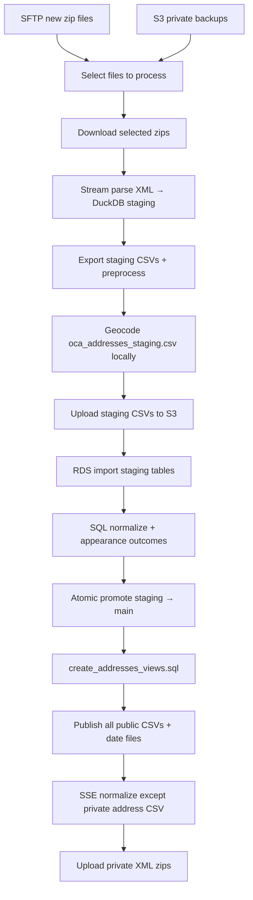

# OCA ETL pipeline

This directory contains the Extract–Transform–Load pipeline that ingests NY State housing court XML from OCA, parses it into relational tables, loads PostgreSQL on RDS, geocodes addresses, and publishes CSVs to S3. This process works with the protected address-level data ("level 2") but maintains public exports of the deidentified (zip code only, "level 1") version with the full address data kept only in secure S3 and RDS for organization under the legal agreement with OCA.

Entry points:

- [`oca_update.py`](../oca_update.py) — weekly ETL → `oca_etl()` in [`etl.py`](etl.py)
- [`oca_geocode_backfill.py`](../oca_geocode_backfill.py) — on-demand RDS backfill (`lat IS NULL` only); not part of weekly ETL

## Pipeline flow (weekly)

Each weekly run is orchestrated sequentially in `oca_etl()`. There is **no** post-promotion `geocode_addresses()` on the weekly path. See [`etl_stages.py`](etl_stages.py) for stage implementations.

## Stages

| Stage | Module | What it does |
|-------|--------|--------------|
| Select files | `etl_file_selection.py`, `etl_stages.select_input_files` | Picks new SFTP zips and/or S3 private replays (`REPROCESS_GLOB`); skips manifest-completed files unless `FORCE_REPROCESS=true`. |
| Download | `etl_stages.download_selected_files` | New files from SFTP; replay files from S3 private backup. |
| Parse | `parsers.py`, `duckdb_database.py`, `parse_manifest.py` | Streaming XML parse into local DuckDB (`staging.duckdb`); batched writes via `parse_write_buffer.py` with per-case windows (`begin_case` / `discard_case` on error—no partial case rows). Per-zip `cases_seen` / `cases_parsed_ok` / `cases_failed` (+ capped `error_samples`) on `etl_files.details`. Default lenient: promote/publish still run; `etl_files.status = 'completed'` only when **`cases_failed = 0`** after promote. `PARSE_FAIL_FAST` aborts before export/promote. Address rows have no lat/lon until CSV geocode. |
| Export staging | `etl_stages.export_staging_csvs` | DuckDB `COPY` with Postgres-compatible transforms; manifest step `export_staging`. No S3 upload yet. |
| Geocode staging | `etl_geocode.geocode_staging_addresses_csv`, `etl_stages.geocode_staging_csvs` | Geocode **every** row in `oca_addresses_staging.csv`; write `oca_addresses_staging_geocoded.csv`, copy over staging CSV; manifest step `geocode_staging`. |
| Upload staging | `etl_stages.upload_staging_csvs`, `etl_publish.list_staging_csvs_in_dir` | Upload only whitelisted `{table}_staging.csv` files (from `OCA_TABLES`); ignores geocoder temps and other junk; manifest step `upload_staging`. |
| Import + promote | `etl_stages.import_and_promote_staging`, `etl_promotion.py` | Bootstrap core tables, import staging CSVs via `aws_s3`, normalize, promote; batch `geom` UPDATE from lat/lon. |
| Publish public | `etl_stages.publish_public_artifacts` | `create_addresses_views.sql` (views only); export all `OCA_TABLES` and address views; upload date badge files. Skipped when `SKIP_PUBLIC_PUBLISH=true` (manifest steps recorded with `skipped` in details). |
| Normalize encryption | `etl_stages.normalize_public_s3_encryption` | SSE-S3 on published keys except `oca_addresses_private.csv`. Skipped with `SKIP_PUBLIC_PUBLISH=true`. |
| Upload private | `etl_stages.upload_private_source_files` | Back up raw XML zips to S3 `private/`. |

### RDS backfill (not weekly)

| Stage | Module | What it does |
|-------|--------|--------------|
| Geocode refresh | `etl_stages.geocode_addresses`, `oca_geocode_backfill.py` | Fetch `oca_addresses` where `lat IS NULL`; Geosupport + Census; upsert by natural address key + `geom`. Manifest step `geocode_refresh`, run `mode='geocode_backfill'`. Does not publish. |

## Key modules

### Connectivity

- [`sftp.py`](sftp.py) — list and download raw XML zip files from OCA SFTP.
- [`s3.py`](s3.py) — S3 upload/download, encryption normalization (`update_encryption`).
- [`database.py`](database.py) — PostgreSQL connection (NYCDB-derived), schema `search_path`, TCP keepalives, automatic reconnect after idle drops, transactions, `aws_s3` import/export helpers.

### Parse and local staging

- [`parsers.py`](parsers.py) — stream `<Index>` nodes from XML; per-case child table replace semantics; delete-event handling.
- [`duckdb_database.py`](duckdb_database.py) — local DuckDB staging DB; export to CSV with contract transforms.
- [`parse_write_buffer.py`](parse_write_buffer.py) — buffer INSERTs and flush in transaction windows (`PARSE_WRITE_*` env knobs).
- [`staging_csv_export.py`](staging_csv_export.py) — per-table export specs (Postgres array literals, nullable ints, appearances column rules).

### ETL orchestration

- [`etl.py`](etl.py) — run orchestrator, manifest lifecycle, stage sequencing.
- [`etl_constants.py`](etl_constants.py) — table list, zip patterns, S3 folder constants.
- [`etl_run_manifest.py`](etl_run_manifest.py) — `etl_runs` / `etl_files` / `etl_steps` bookkeeping.
- [`etl_helpers.py`](etl_helpers.py) — paths, CSV row checks, PLUTO download, local SVG date badge files.
- [`etl_csv.py`](etl_csv.py) — streaming CSV normalization for tables not handled at export time.
- [`etl_promotion.py`](etl_promotion.py) — atomic `promote_staging_to_main()`; count/checksum hooks for validation.
- [`etl_publish.py`](etl_publish.py) — S3 export helpers and encryption key filtering.
- [`etl_geocode.py`](etl_geocode.py) — staging CSV geocode (`read_staging_addresses_csv`, `geocode_staging_addresses_csv`); RDS fetch/upsert for backfill.

### Geocoding

- [`geocode_record.py`](geocode_record.py) — address normalization (usaddress), NYC Geosupport, Census batch geocoder.

## SQL scripts (`lib/sql/`)

Scripts run against the active session schema (`DB_SCHEMA` / `search_path`).

| Script | Role |
|--------|------|
| `create_tables.sql` | Non-destructive bootstrap; `oca_addresses.geom` + GIST index |
| `create_tables_staging.sql` | Per-run RDS staging tables (no `geom` on address staging) |
| `create_tables_staging_duckdb.sql` | Local DuckDB staging DDL |
| `normalize_staging_after_import.sql` | Nullable int coercion after S3 import |
| `update_appearance_outcomes.sql` | Assign `appearanceid`, expand outcomes JSON |
| `promote_staging_to_main.sql` | Staging → main promotion; batch `geom` from lat/lon |
| `ensure_promotion_indexes.sql` | Indexes for promotion and address natural keys |
| `select_addresses_needing_geocode.sql` | Backfill delta (`lat IS NULL`) |
| `create_geocode_staging_table.sql`, `upsert_geocoded_addresses.sql` | Backfill staging merge; sets `geom` |
| `create_addresses_views.sql` | Public address views (no geom DDL) |
| `create_etl_manifest_tables.sql` | Run manifest DDL |

Legacy/manual only: `reset_addresses_table.sql`, `update_metadata.sql`.

## Idempotency and run control

- **Manifest** — weekly runs record `export_staging`, `geocode_staging`, `upload_staging`, `promote_staging`, `publish_public`, `normalize_s3_encryption`, `upload_private`. Backfill runs record only `geocode_refresh`.
- **Connection resilience** — TCP keepalives and `ensure_connection()` before promote and before publish (publish connection refresh skipped when `SKIP_PUBLIC_PUBLISH=true`).
- **Reprocess** — `REPROCESS_GLOB` selects S3 private backups; manifest skips files in `completed_reprocess_files` (promoted with `cases_failed = 0`) unless `FORCE_REPROCESS=true`. Zips with prior case-level parse failures stay eligible for reprocess without force.
- **Schema isolation** — `DB_SCHEMA` + `S3_PREFIX` for refactor/E2E without touching production paths.
- **Weekly geocode** — all staging CSV address rows (re-geocodes rows that already have lat/lon in the file).
- **Backfill geocode** — only `lat IS NULL` with a house number; upsert matches on address line columns, not `indexnumberid` alone.
- **Publish** — every successful weekly run exports the full public snapshot (all core tables and address views). `SKIP_PUBLIC_PUBLISH=true` is for bulk reprocess only; run a normal publish afterward so public S3 matches RDS.

## Output tables

Core tables (also published as public CSVs): `oca_index`, `oca_causes`, `oca_addresses`, `oca_parties`, `oca_events`, `oca_appearances`, `oca_appearance_outcomes`, `oca_motions`, `oca_decisions`, `oca_judgments`, `oca_warrants`. Defined in [`etl_constants.py`](etl_constants.py).

## Further reading

- Root [README](../README.md) — setup, env vars, Docker invocation, backfill CLI
- [`docs/operations/weekly-etl-scheduling.md`](../docs/operations/weekly-etl-scheduling.md) — cron, Kubernetes, EventBridge/ECS
- [`docs/`](../docs/) — data dictionary links and raw XML notes
